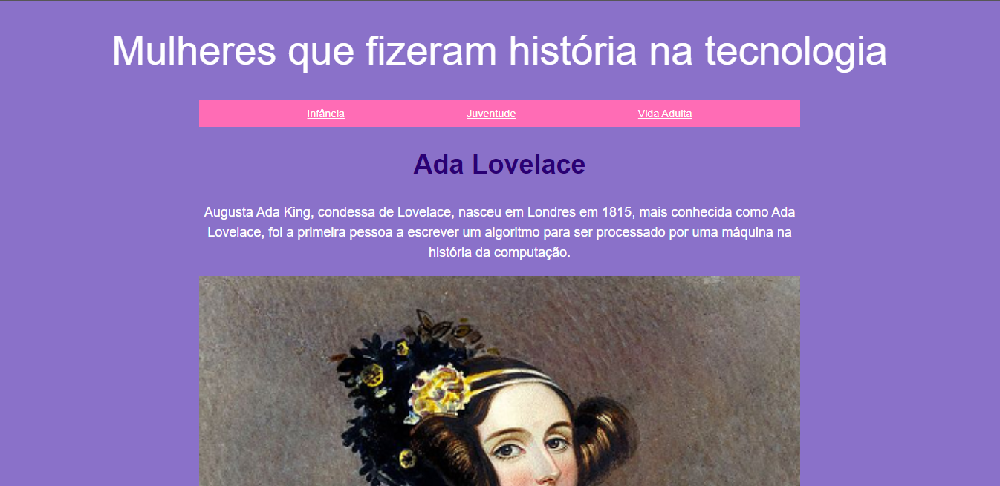

<h1 align="center"> Ada Lovelace </h1>

 

  

## 🚀 Tecnologias

Esse projeto foi desenvolvido com as seguintes tecnologias:

- HTML, CSS e JavaScript
- Git e GitHub 

## 💻 Descrição

A tela foi criada para informar sobre a vida de Ada Lovelace e outras mulheres que fizeram história na tecnologia.
 
- [Acesse o projeto finalizado, online](https://andresa43.github.io/Ada_Lovelace/)

## 📝 Licença

Esse projeto está sob a licença MIT.

---

Feito com ♥ Progra{m}aria 👋 [Acesse o site!](https://www.programaria.org/)
